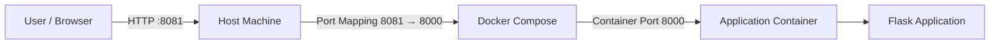

# Port Demo Application – Docker & CI Pipeline

## Project Overview

This project demonstrates how an application runs inside a Docker container, how ports are mapped between the host and container, and how a CI pipeline builds and pushes the Docker image automatically using GitHub Actions.

The main focus of this project is to clearly understand and explain Docker port mapping and Docker-based CI workflows.

---

## Technologies Used

- Python (Flask)
- Docker
- Docker Compose
- GitHub Actions
- Docker Hub

---

## Application Description

- This is a simple Flask application.
- It starts an HTTP server.
- It exposes a `/health` endpoint.
- The application runs inside a Docker container.
- The listening port is read from an environment variable.

---

## Ports Explanation (Important)

- Application Port (inside container): **8000**
- Host Port: **8081**

### Why These Ports Are Used

- The Flask app listens on port **8000** inside the container.
- Docker maps host port **8081** to container port **8000**.
- Users access the application using `http://localhost:8081`.

---

## Architecture Diagram

**Architecture Flow Explanation**

1.The user sends an HTTP request to the host machine on port 8081.

2.Docker Compose forwards the request to the container on port 8000.

3.The Flask application receives the request and processes it.

4.The response is sent back to the user.

**Dockerfile Design**

- The Dockerfile follows best practices by using a lightweight base image.

- The application runs as a non-root user inside the container.

- The container exposes the application port and reads it using environment variables.

- All application logs are written to standard output.

- A docker ignore file is included to reduce image size.

**Docker Compose Usage**

- Docker Compose is used to define and run the application service.

- It passes environment variables into the container and maps the host port to the container port.

- This allows the application to be started using a single command and ensures consistent behavior across environments.

**CI Pipeline Overview**

- A CI pipeline is implemented using GitHub Actions.

- The pipeline is triggered automatically on every push to the main branch.

- The pipeline builds the Docker image, tags it correctly, and pushes it to Docker Hub.

- A basic verification step ensures the application starts successfully.

**Docker Hub Integration**

- The Docker image is pushed to Docker Hub using a standard naming format that includes the Docker Hub username, application name, and tag.

- This allows the image to be pulled and run on any machine.

**GitHub Secrets Usage**

- Sensitive information such as Docker Hub credentials is stored securely using GitHub Secrets.

- These secrets are not visible in logs or source code and are accessed only by the CI pipeline.

**Logging and Health Checks**

- The application writes logs to standard output to ensure visibility in Docker logs.

- The health endpoint provides a clear success response, making it suitable for monitoring and verification.

**Key Decisions Made**

- Flask was chosen for simplicity and ease of understanding.

- Docker Compose was used to clearly demonstrate port mapping and service configuration.

- GitHub Actions was selected to automate the build and push process.

**Final Summary**

This project demonstrates a complete containerized application workflow with a strong focus on ports, networking, Docker Compose orchestration, and CI automation.

